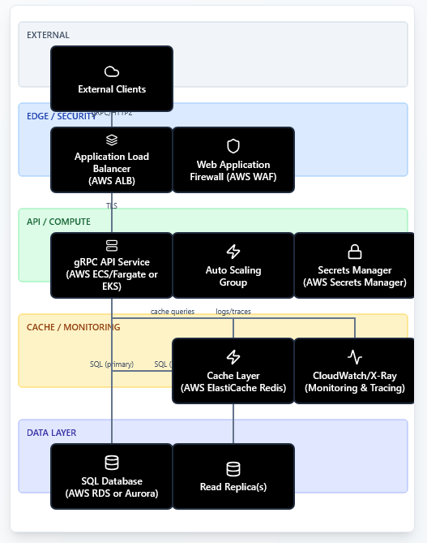

# Task Instructions

## Task 1

Design a cloud-based system block architecture
(using available services, packages and components from AWS or GCP, plus any custom code you may require)
for access to an SQL (or similar) database
through an externally-facing gRPC API.
Provide a block diagram of how these services and components connect together.
You do not have to go into detail of the individual RPCs or specify the external API.

## Acceptance Criteria

• Prepare a ~30 mins presentation detailing your solution for discussion at the
interview.
• Please submit all code in a zipped folder the evening before the interview.

## Options

- Use Databricks API and Spark Connect to provide gRPC output required.
- Use Spark db and gRPC
    - https://grpc.io/docs/languages/python/quickstart/
    API Gateway (gRPC)	Cloud Endpoints + ESPv2
    ECS/Fargate	Cloud Run / GKE / Compute Engine
    Amazon RDS	Cloud SQL
    VPC/Security Groups	VPC firewall rules

# Things to consider
- Network security -- having a layer that everyone must go through before they can access anything
- Access Control - AD groups / IAM controls
- Language the gRPC is built in? GO?

I'm not sure what this means????

- should we include user management IAM/AD groups?
- how much code is expected?
- how many requests will be occuring - should I consider load balancing options 

if there's lots of requests then load balancing will need to be considered.

AWS ECS to host gRPC

# Why AWS over Google cloud??

# For hosting my gRPC api
# ECS vs Lambda